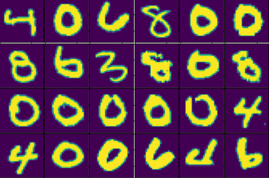
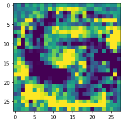

# Interpretability

`deepdream.ipynb` - Inceptionism on VGGFace2-ResNet50
---
An example for the most commonly used neural network interpretation method that is a post-hoc interpretation of the learned model. Post-hoc interpretability is the property of models that do not deal with how does the model work but deal with explanations made after the learning is over. The concept is examined in <i>Lipton, The Mythos of Model Interpretability</i> as follows:

<b>3.2. Post-hoc Interpretability</b>

<i>
"Post-hoc interpretability presents a distinct approach to extracting information from learned models. While posthoc interpretations often do not elucidate precisely how a model works, they may nonetheless confer useful information for practitioners and end users of machine learning. Some common approaches to post-hoc interpretations include natural language explanations, visualizations of learned representations or models, and explanations by example (e.g. this tumor is classified as malignant because to the model it looks a lot like these other tumors). To the extent that we might consider humans to be interpretable, it is this sort of interpretability that applies. For all we know, the processes by which we humans make decisions and those by which we explain them may be distinct. One advantage of this concept of interpretability is that we can interpret opaque models after-the-fact, without sacrificing predictive performance."</i>

Then the research talks about several approaches to post-hoc interpretability, one being visualization:

<b>3.2.2. Visualization</b>

<i>
"Another common approach to generating post-hoc interpretations is to render visualizations in the hope of determining qualitatively what a model has learned. One popular
approach is to visualize high-dimensional distributed representations with t-SNE (Van der Maaten & Hinton, 2008),
a technique that renders 2D visualizations in which nearby
data points are likely to appear close together.
Mordvintsev et al. (2015) attempt to explain what an image classification network has learned by altering the input
through gradient descent to enhance the activations of certain nodes selected from the hidden layers. An inspection
of the perturbed inputs can give clues to what the model
has learned. Likely because the model was trained on a
large corpus of animal images, they observed that enhancing some nodes caused the dog faces to appear throughout
the input image.
In the computer vision community, similar approaches
have been explored to investigate what information is retained at various layers of a neural network. Mahendran
& Vedaldi (2015) pass an image through a discriminative
convolutional neural network to generate a representation.
They then demonstrate that the original image can be recovered with high fidelity even from reasonably high-level
representations (level 6 of an AlexNet) by performing gradient descent on randomly initialized pixels"</i>

`deepdream_mnist.ipynb` - dense_1, 32
---
| Maximal activation examples  | Visualization by optimization |
| ------------- | ------------- |
|   |   |
